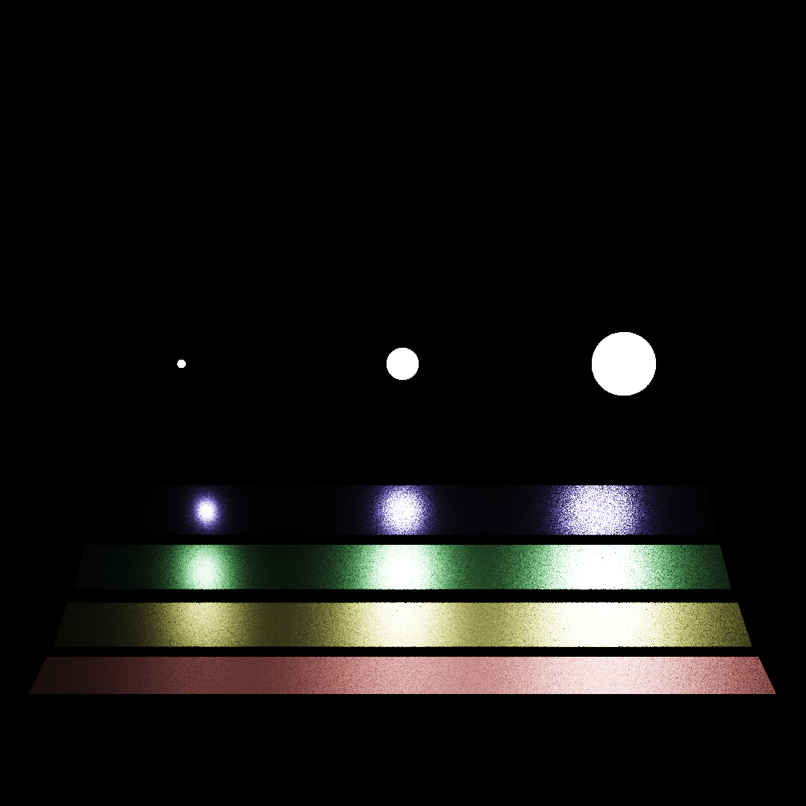
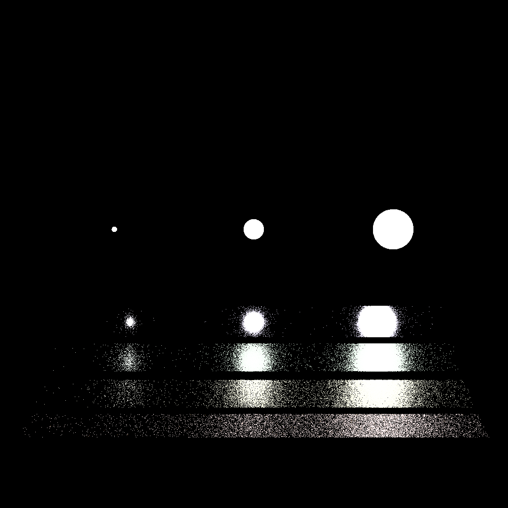
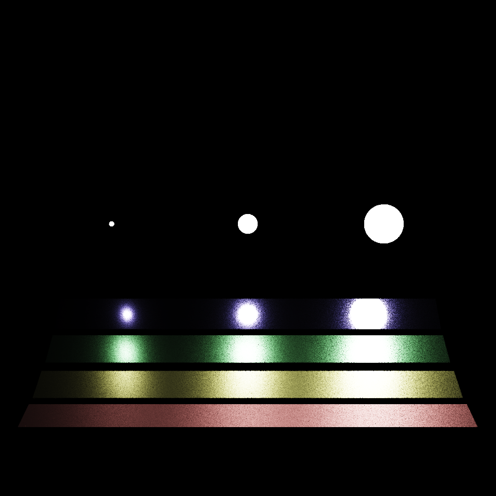
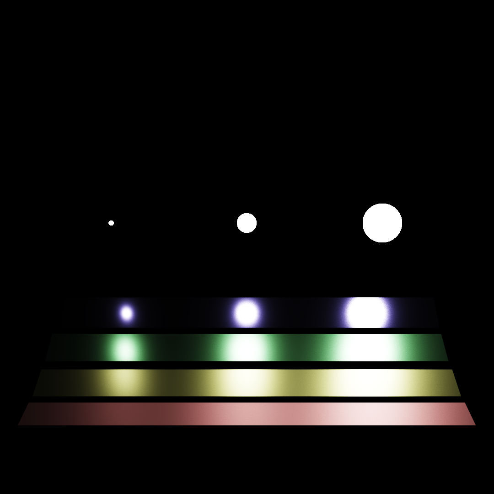

CUDA Path Tracer
================

**University of Pennsylvania, CIS 565: GPU Programming and Architecture, Project 3**

| Direct Light sample(20spp)   | BSDF Sample (20spp)      | MIS(20spp)                  |
| :-----------------------:    | :----------------------: | --------------------------- |
|   | |     |

| Direct Light sample(2000spp)   | BSDF Sample (2000spp)      | MIS(2000spp)                  |
| :-----------------------:    | :----------------------: | --------------------------- |
|   | |     |

TODO:
- [ ] MIS
    - [x] BSDF sample(Lambertian, Dielectric, Microfacet, Metallic)
    - [ ] Light sample(light of different shape: sphere, cube, plane, triangles)
      - [x] sphere light
      - [x] cube light
      - [x] obj(triangles) light
      - [ ] env light
    - [x] Integrate these two sample strategies
    - [ ] MIS env map
    - [ ] MIS based on luminance of light
    - [ ] Prove the unbiasedness of this method
- [ ] DOF
- [ ] Denoising
    - [ ] OpenImage Denoiser built [OpenImage](https://www.openimagedenoise.org/)
        - CPU only for now
    - [ ] Integrate it into project